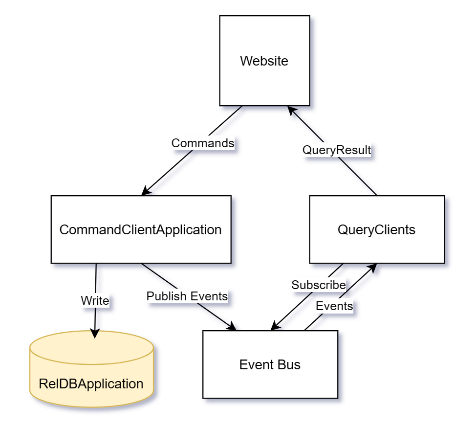

# CQRS and Event-Sourcing

Command Query Responsibility Segregation, or CQRS for short, is a well-known pattern for data management. CQRS enables the construction of large, scalable systems that have significantly more write operations than read operations. There are three essential data sources involved:

1. Write Repository
2. Event Log
3. Read Repository

The Write Repository always contains the true state of the system. With each successful write operation, an event is triggered, which is stored in the Event Log and distributed to the various Read Repositories via the Event Bus. As a result, the Read Repositories exhibit eventual consistency. This means that the data is updated with a slight delay. Afterward, consumer applications can query the perfectly tailored data for their specific use cases from the Read Repositories.

This Gradle project demonstrates the simplified implementation of CQRS and its behavior in action. Additionally, it should be noted that there are better communication models and database structures available for the Event Bus and Read Repositories.

## Architecture

In the current system, there is a frontend that was developed as a website using React and Tailwind CSS. This website primarily communicates with the CommandClientApplication to write data and with the different QueryClients to read data.

  

The CommandClientApplication writes the desired changes to the RelDBApplication after each command. This is based on the H2 database (in-memory), which can easily be reconfigured to PostgreSQL. If the write operation is successful, the event is published over the Event Bus and sent to the listed subscribers. These subscribers are the Query Clients that have subscribed beforehand. The broker in the Event Bus does not have a broadcast feature, as it would only have been needed for the DeleteAll event. The website can now query the data from the Query Clients.

## Starting the application

The backend can be found in the CQRSundEventSourcing directory.
To start the backend, all six services must be started:

- RelDBApplication
- CommandClientApplication
- EventBus
- QueryClientBookingApplication
- QueryClientCustomerApplication
- QueryClientRoomApplication

Afterward, you can access the database via http://localhost:8082/h2-console

To start the frontend, please navigate to the **Frontend** directory and follow the instructions in the [README](./Frontend/README.md).

Before performing any actions on the website, you first need to click on the **Initialize Database** button.
